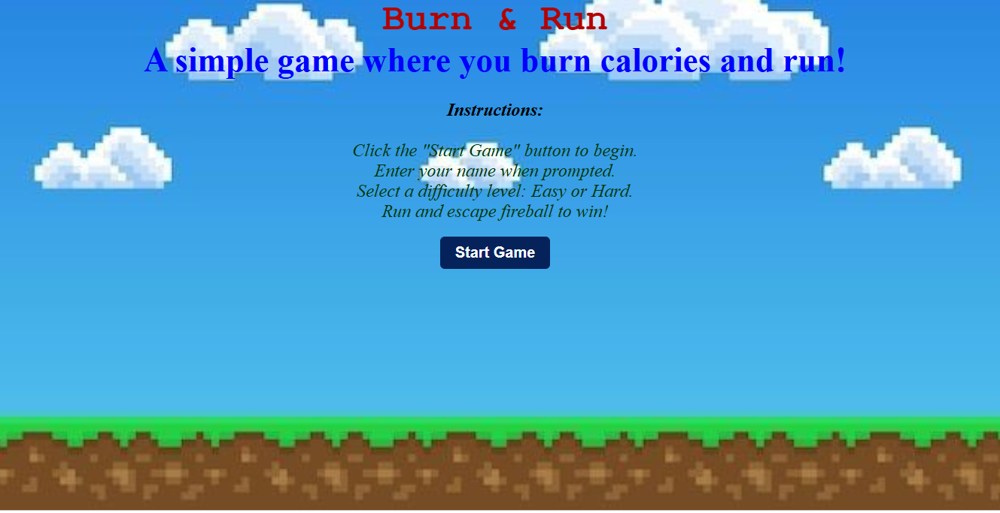

# Burn & Run

  

## About the Game

**Burn & Run** is a simple browser-based dodging game .A cannon keeps launching fireballs at you, and all you have to do is dodge them. Every fireball you escape bumps your score up by one. Survive long enough and hit the target score before time runs out, and you win. Get hit, and it's game over (with a "Try Again" button waiting for you).

**How to plays:**
- An intro screen greets you and asks for your name.
- You then pick a difficulty: **Easy** or **Hard**.
- Once you hit **Start**, the game begins:
  - **Easy Mode** — Standard fireball speed and spawn rate.
  - **Hard Mode** — Adds extra obstacles on top of the fireballs for a tougher challenge.
- Background music plays throughout, with a game-over sound effect when you get hit.
- Reach the minimum score within the time limit to win!

## Getting Started

- **Play the game:** [Burn & Run — Live Deployment](https://eshaabbasi.github.io/Burn-Run--game/)

### Controls
| Key | Action |
|-----|--------|
| ↑ (Up Arrow) | Move up |
| ↓ (Down Arrow) | Move down |

### Instructions
1. Click **Start Game** on the title screen.
2. Enter your name when prompted.
3. Select a difficulty level — **Easy** or **Hard**.
4. Use the up/down arrow keys to dodge the fireballs  and rack up your score before time runs out!

## Technologies Used
- HTML
- CSS
- JavaScript

## Contributors
| Name | Role | Duration |
|------|------|----------|
| *Esha Ashfar* | Developer | 1 Week |

## Attributions
- **Deployment:** [https://eshaabbasi.github.io/Burn-Run--game/](https://eshaabbasi.github.io/Burn-Run--game/)
- **Character, cannon, and fireball images:** [ToppNG — Cartoon Game Characters PNG](https://toppng.com/free-image/cartoon-game-characters-PNG-free-PNG-Images_87479)
- **Background music & game-over sound effect:** [Pixabay — Game Over Sound Effects](https://pixabay.com/sound-effects/search/game-over/)
- **Fonts:** [Google Fonts](https://fonts.google.com/)

## Next Steps
Planned future enhancements (stretch goals):
- Add a leaderboard to track and display high scores across players.
- Introduce additional difficulty levels or a progressively scaling difficulty as the game continues.
- Add power-ups (e.g., temporary shields or slow-motion for fireballs).
- Add animated character sprites instead of static images.
- Include a pause/resume feature.
